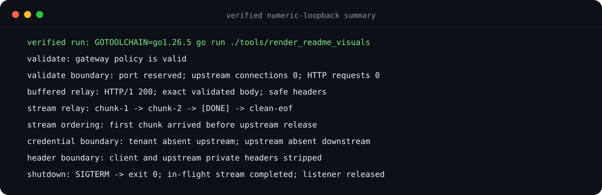
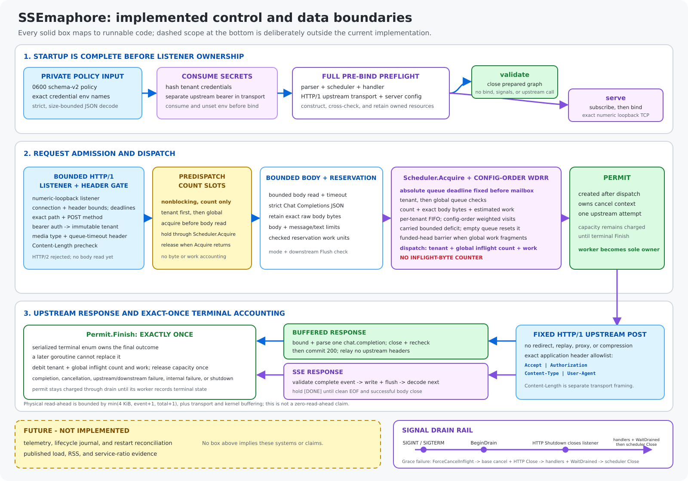
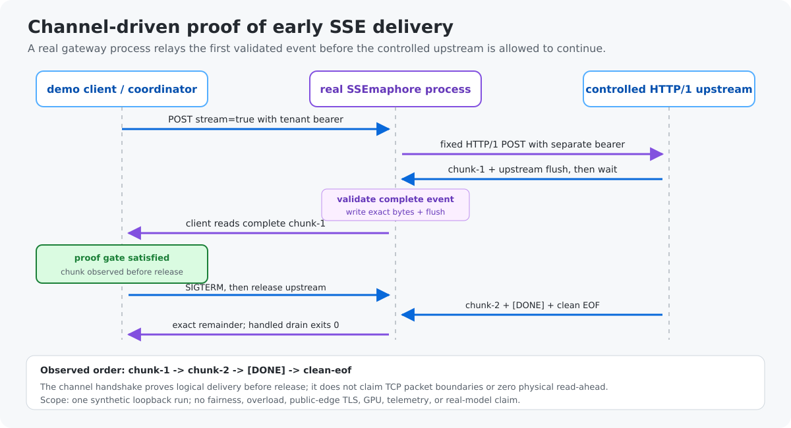
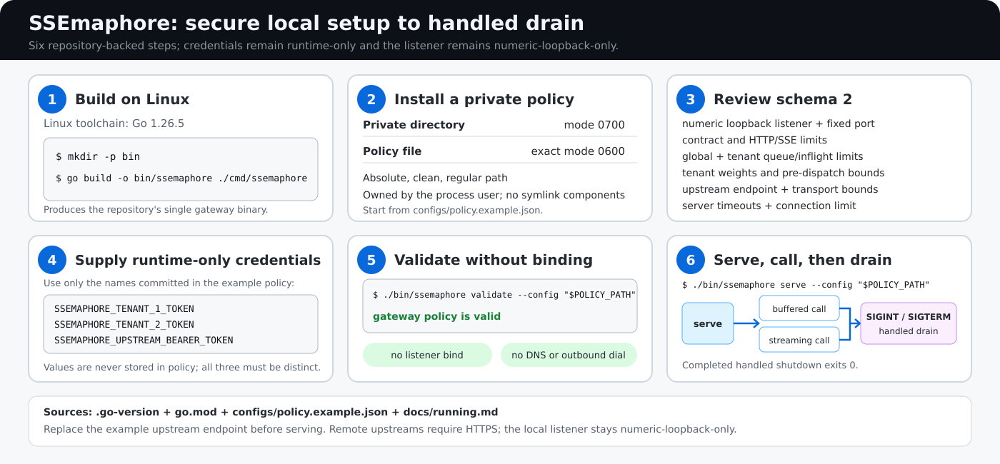

# SSEmaphore

Bounded, cancellation-aware admission control for one fixed Chat
Completions-compatible upstream.

SSEmaphore is a Linux loopback gateway for a strict streaming and buffered
subset of `POST /v1/chat/completions`. It maps configured bearer credentials to
immutable tenants, schedules bounded estimated work with weighted deficit round
robin, and relays validated buffered responses or SSE events through a fixed
HTTP/1 upstream transport.

> **Implemented:** strict request and response contracts, tenant/global
> admission bounds, weighted DRR, buffered and SSE relay, fixed-destination
> transport, bounded inbound serving, and signal-owned shutdown.
>
> **Not implemented:** telemetry, a lifecycle journal, restart reconciliation,
> and published load, RSS, or weighted-service evidence.

## Verified loopback result

[](docs/visuals/generated/loopback-terminal.svg)

This content-free evidence-summary panel is regenerated from one built Linux gateway
binary, separate `validate` and `serve` child processes, one tenant, one
controlled HTTP/1 upstream, and two synthetic numeric-loopback requests. The
harness proves only the checks shown:

- `validate` succeeds without releasing the reserved listener, opening an
  upstream TCP connection, or sending an upstream HTTP request;
- one buffered request relays the exact valid response body with safe
  gateway-owned headers;
- the first complete SSE event reaches the client before the controlled
  upstream is released;
- tenant and upstream credentials remain on their intended sides of the
  gateway, and private client/upstream headers are not relayed;
- a real `SIGTERM` closes the listener while the in-flight stream completes,
  then the process exits `0` and the address can be rebound.

[Machine-readable evidence](docs/visuals/generated/loopback-evidence.json) ·
[plain evidence summary](docs/visuals/generated/loopback-evidence.txt) ·
[SHA-256 provenance manifest](docs/visuals/generated/manifest.sha256.json)

## Why this exists

An inference upstream can remain healthy while its callers are already
building an unhealthy queue. Accepting everything turns overload into hidden
latency, lets one tenant capture shared capacity, and keeps canceled or expired
work alive longer than its client.

SSEmaphore places one inspectable decision point before one fixed upstream:
validate strictly, account before dispatch, schedule bounded estimated work,
commit only a validated buffered response or complete SSE event, and release
every permit through one terminal path.

## Architecture

[](docs/visuals/generated/architecture.svg)

The full-resolution diagram separates implemented runtime boundaries from the
dashed **Future — not implemented** box. In particular, pre-dispatch gates are
nonblocking count slots; queue admission separately accounts count, exact body
bytes, and estimated work; in-flight accounting uses count and work, not
bytes.

## Implemented boundaries

| Boundary | Current implementation |
| --- | --- |
| Ingress | Exact path, method, bearer, media-type, and queue-timeout precedence; strict JSON subset; finite connection, header, body, and deadline limits. |
| Pre-dispatch | Tenant-first then global nonblocking count slots, held from before body read until scheduler acquisition returns. |
| Admission | Tenant-first then global queue decisions over count, exact body bytes, and estimated work; absolute queue deadlines are fixed before the scheduler mailbox. |
| Scheduling | Config-order per-tenant FIFO weighted DRR, bounded carried deficit, tenant/global in-flight count and work, and a funded-head barrier under fragmented global work. |
| Upstream | One startup-validated URL, separate bearer, exact application-header allowlist, HTTP/1, and no redirects, environment proxy, transparent compression, or automatic replay. |
| Buffered response | The entire bounded `chat.completion` response validates and closes before `200`; no upstream headers are relayed. |
| SSE response | One complete event validates and flushes before the next logical event is decoded; `[DONE]` waits for clean EOF and successful body close. |
| Lifecycle | Client cancellation reaches the permit context; `SIGINT`/`SIGTERM` starts graceful shutdown with a forced fallback; terminal accounting releases exactly once through `Permit.Finish`. |

Estimated work is:

```text
body_bytes + completion_weight * max_completion_tokens
```

It is a bounded scheduling estimate, not a tokenizer, GPU-cost predictor, or
latency estimate.

## Streaming proof

[](docs/visuals/generated/stream-sequence.svg)

The controlled upstream flushes `chunk-1` and waits. The client must observe
the complete first event before the harness sends `SIGTERM` and releases the
upstream. The same in-flight request then relays `chunk-2`, withholds `[DONE]`
until clean EOF, and completes before the process exits.

This proves logical event ordering in one synthetic loopback run. It does not
prove TCP packet boundaries, zero physical read-ahead, fairness under load,
public-edge TLS, GPU reclamation, telemetry, or real-model compatibility.
Physical read-ahead is bounded by
`min(4 KiB, event_limit + 1, total_limit + 1)`, plus transport and kernel
buffering.

## Quick start

[](docs/visuals/generated/setup-workflow.svg)

The runnable command targets Linux. Reproducible builds and evidence require
the exact Go 1.26.5 toolchain:

```sh
export GOTOOLCHAIN=go1.26.5
mkdir -p bin
go build -o bin/ssemaphore ./cmd/ssemaphore

install -d -m 700 "$HOME/.config/ssemaphore"
install -m 600 configs/policy.example.json \
  "$HOME/.config/ssemaphore/policy.json"
POLICY_PATH="$(realpath "$HOME/.config/ssemaphore/policy.json")"
```

Before serving, replace the example upstream endpoint and review every schema
version 2 resource bound. Supply three distinct opaque values through the
environment names committed in the example policy:

```sh
export SSEMAPHORE_TENANT_1_TOKEN='replace-with-a-random-tenant-token'
export SSEMAPHORE_TENANT_2_TOKEN='replace-with-a-different-tenant-token'
export SSEMAPHORE_UPSTREAM_BEARER_TOKEN='replace-with-the-upstream-token'
```

Validate the complete object graph without binding or dialing, then serve:

```sh
./bin/ssemaphore validate --config "$POLICY_PATH"
# gateway policy is valid

./bin/ssemaphore serve --config "$POLICY_PATH"
```

`serve` is silent after successful startup. The
[local runbook](docs/running.md) contains exact buffered and streaming `curl`
requests, credential grammar, policy-file ownership rules, exit codes, and
shutdown behavior.

## Reproduce the evidence

The generator builds and launches the real CLI, creates random process-scoped
credentials, uses a private temporary directory for its binary and policy,
runs a controlled numeric-loopback buffered request and stream, sends a real
`SIGTERM`, and emits only bounded content-free results.

```sh
GOTOOLCHAIN=go1.26.5 go run ./tools/render_readme_visuals
GOTOOLCHAIN=go1.26.5 go run ./tools/render_readme_visuals --check
```

The same generator renders the terminal result, sequence, architecture, and
setup diagrams. The manifest binds production sources, generator sources, the
example policy, runbook, and published artifacts with SHA-256. These digests
support deterministic review; they are not signatures or attestations.

Runtime loopback evidence deliberately contains no ports, endpoints, host
paths, environment-variable names, request IDs, raw headers or bodies,
timestamps, durations, credential values, or secret-derived hashes. The static
setup diagram shows only the three non-secret environment names committed in
the example policy.

## Design decisions worth reviewing

- **Deadline before mailbox:** queue time cannot be extended by scheduler
  mailbox contention.
- **Funded-head barrier:** once a FIFO head has enough DRR credit, smaller work
  cannot bypass it merely because global work capacity is fragmented.
- **One non-replayable upstream attempt:** the fixed transport cannot redirect,
  proxy, transparently decompress, or automatically replay inference work.
- **Commit after validation:** buffered JSON is complete before `200`; an SSE
  event is complete before its exact bytes are written and flushed.
- **Terminal marker after EOF:** `[DONE]` is retained until clean EOF,
  successful upstream-body close, and context checks all succeed.
- **Listener closes before drain completes:** graceful HTTP shutdown stops new
  connections while admitted work finishes; a bounded forced path attributes
  shutdown before canceling active permits.

## Verification

The repository CI runs the same safety matrix used locally:

```sh
test -z "$(gofmt -l .)"
GOTOOLCHAIN=go1.26.5 go vet ./...
GOTOOLCHAIN=go1.26.5 go test ./... -shuffle=on -count=1
GOTOOLCHAIN=go1.26.5 go test -race ./... -shuffle=on -count=1
GOARCH=386 GOTOOLCHAIN=go1.26.5 go test ./... -shuffle=on -count=1
GOTOOLCHAIN=go1.26.5 go run ./tools/render_readme_visuals --check
```

Tests include strict decoder cases, corpus-seeded fuzz inputs, scheduler golden
traces, an independent seeded DRR oracle, deterministic cancellation races,
raw HTTP wire tests, real loopback integration, repeated shutdown, and
committed-visual freshness.

## Scope and roadmap

SSEmaphore intentionally remains one local gateway in front of one upstream.
It does not host models, route across providers or replicas, terminate inbound
TLS, expose a public edge, cache prompts, bill users, or claim that HTTP
cancellation releases GPU memory.

Future work is kept outside the implemented architecture:

- content-free metrics and traces;
- a bounded lifecycle journal;
- restart reconciliation;
- published load, RSS, overhead, queue-accuracy, and weighted-service evidence.

Those features become current only when their code and reproducible evidence
land together.

## Documentation

- [API contract](docs/api.md) — exact accepted request and response subset.
- [Local runbook](docs/running.md) — policy, credentials, commands, and calls.
- [Server lifecycle](docs/server-lifecycle.md) — listener ownership and drain
  invariants.
- [Threat model](docs/threat-model.md) — trust boundaries and abuse cases.
- [Project charter](docs/charter.md) — release evidence and non-goals.

## Prior art

SSEmaphore does not claim a new scheduling algorithm or replace broader
inference-gateway, routing, and prioritization systems such as
[LiteLLM scheduling](https://docs.litellm.ai/docs/scheduler) or the
[Kubernetes Gateway API Inference Extension](https://gateway-api-inference-extension.sigs.k8s.io/).
Its narrower purpose is to make bounded estimated-service admission,
cancellation semantics, and failure behavior reviewable in one reference
implementation. The scheduler is based on Shreedhar and Varghese's
[deficit round-robin paper](https://openscholarship.wustl.edu/cse_research/339/).

## License

[MIT](LICENSE)
